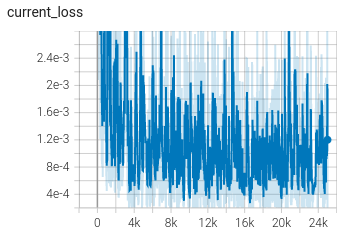
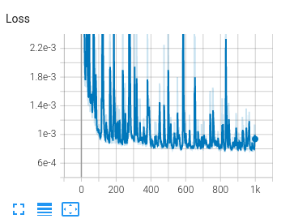

# SRCNN-Pytorch

A PyTorch implementation of Super-Resolution Convolutional Neural Network (SRCNN) from scratch, with support for both MSE and Perceptual Loss training.


## Overview

This project implements the SRCNN architecture for single-image super-resolution. The network learns an end-to-end mapping from low-resolution to high-resolution images using three convolutional layers: patch extraction, non-linear mapping, and reconstruction. A perceptual loss variant using VGG19 feature matching is also implemented as an alternative to standard MSE loss.

## Architecture

| Layer | Operation | Kernel | Channels |
|-------|-----------|--------|----------|
| 1 | Conv2D + ReLU | 9×9 | 3 → 64 |
| 2 | Conv2D + ReLU | 1×1 | 64 → 32 |
| 3 | Conv2D | 5×5 | 32 → 3 |

The perceptual loss extracts features from VGG19 `relu2_2` and combines feature-level MSE with pixel-level MSE using a weighted sum.

## Tech Stack

`Python` · `PyTorch` · `TorchVision` · `TensorBoard` · `scikit-image`

## Getting Started

```bash
git clone https://github.com/pathal-r/SRCNN-Pytorch.git
cd SRCNN-Pytorch
pip install -r requirements.txt
```

### Download Dataset

```bash
cd utils
python div2k_downloader.py
cd ..
```

### Train

```bash
python train.py
```

TensorBoard logging and checkpoint saving are enabled by default.

### Test

```bash
python test.py
```

Output images are saved to the `output/` directory.

## Training Visualization

| Current Loss | Epoch Loss |
|:---:|:---:|
|  |  |

## Project Structure

```
SRCNN-Pytorch/
├── model/          # SRCNN architecture and loss functions
├── base/           # Base model and data loader classes
├── data_loader/    # Div2k dataset loader
├── utils/          # Dataset download utilities
├── baseline/       # MSE and perceptual loss baselines
├── train.py        # Training script
└── test.py         # Inference script
```

## License

See [LICENSE](LICENSE) for details.
